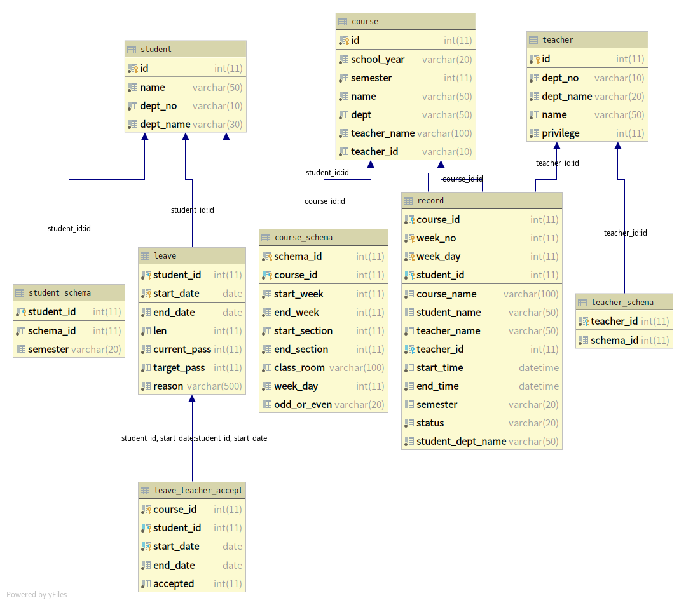

SimpleRestful
==============
*个人为了应付期末作业所写的虚假项目,和实际项目没有任何联系*  

基本不写Java,代码十分混乱,望赐教

## Feature

RESTful Api,虽然目的是SSKDs应用,但还是遵循了以下规则:  

1.将HTTP方法作为动词  
2.不返回JSON数组
    
[查看postman collection请点此处](https://documenter.getpostman.com/view/8711837/SWE57KRi?version=latest#8b24d958-4682-41a2-bd9f-f1a762b4f93d)

功能有:  

1.教师发起签到,发送验证码,课上的学生20秒内必须签到,否则die(参考某HDU签到系统)  

2.学生可以发起若干天数的请假,不同请假天数被分为了不同请假级别,最低只要由请假期间的任课教师通过即可,最高需要由校长通过请假.

## Architecture
MySQL:

Redis: 

--------db0: 

Key(hash): 

    check-in-mem-student   <student_id>=><teacher_id>
Key(hash): 

    check-in-info<teacher_id>=><teacher_name>:<course_id>:<course_name>:<start_time>:<end_time>:<week_day>:<week_no>
---------db1: 

Key(hash): 

    check-in-status:<teacher_id>  <student_id>=>"<未签到|已签到|已请假>:姓名:学院名"
--------db2: 

Keys(String): 

    session-student:<student_id> => <session_id> (EXPIRE <key> 604800)
Keys(String): 

    session-teacher:<teacher_id> => <session_id>(EXPIRE <key> 604800)
--------db3: 

Keys(String): 

    captcha:<student-id>=>code(EXPIRE <key> 30)

## Quick Start

### Build
```
    mvn clean package
```

### Run
```
    cd target&&java -jar demo-0.0.1-SNAPSHOT.jar
```
### Environment
```
   openjdk version "11.0.5" 2019-10-15
   OpenJDK Runtime Environment (build 11.0.5+10)
   OpenJDK 64-Bit Server VM (build 11.0.5+10, mixed mode)
```
### Configuration
   see application.yml.example(application.yml)
### Dependencies
[Spring Boot]()

[Redis]()

[MySQL]()

[MyBatis]()

[Spring Boot Data Redis]()

## Benchmark
please wait...
## LICENSE
MIT License.